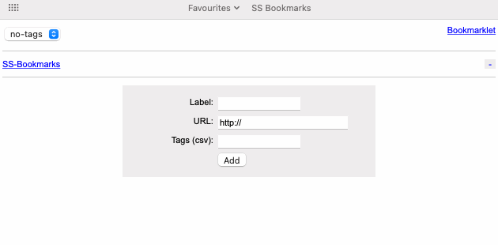

# SS Bookmarks

SS Bookmarks is a single-script PHP bookmarks manager. No database and no additional files/dependencies are needed for it to work.

It looks like this:



There are two ways to deploy SS Bookmarks:

1. Upload the ss-bookmarks.php script to a PHP-enabled web server environment and point your browser at it. It should "just work" with most default configurations of PHP.
2. If you're familiar with Docker you can spin up a micro-service using the build and compose files included in the repo.

You'll notice there are some configs at the top of the script for setting particular behaviours. These are commented inline so it should be obvious what they each do.

Be careful changing anything below the config (things may break!). The only exception to this rule might be the CSS between the ```<style type="text/css">``` and ```</style>``` which you might want to play with (it's pretty safe to do so) to change how SS Bookmarks looks.

## How does it work?

SS Bookmarks stores the bookmarks data *inside itself*. If you look at the script you'll spot an area dedicated to ```/*DATA-START*/``` and ```/*DATA-END*/```. Every time you add or remove a bookmark, the script overwrites itself, injecting or removing data as it goes.

## Disclaimer

SS Bookmarks is intended for personal, single-user scenarios. It's not suited for multi-user or production environments.

It is highly recommended you keep backups enabled in the config, just in case the script interupts in the middle of an overwrite. You don't want to lose your data.

SS Bookmarks has been tested with PHP 7.4.6. It "may" work on earlier versions and "should" work on later versions.

## Improvements wishlist

Feel free to contribute and send through some pull requests for any of these!

- Docker environment variables (to override the configs)
- Task editing
- Mobile viewports/styles for smaller screens
- Add tags when using the bookmarklet

## Other notes

kufbwxfiwy has spun off an alternative/extended version of SS-Bookmarks at https://github.com/kufbwxfiwy/ss-bookmarks-extended.